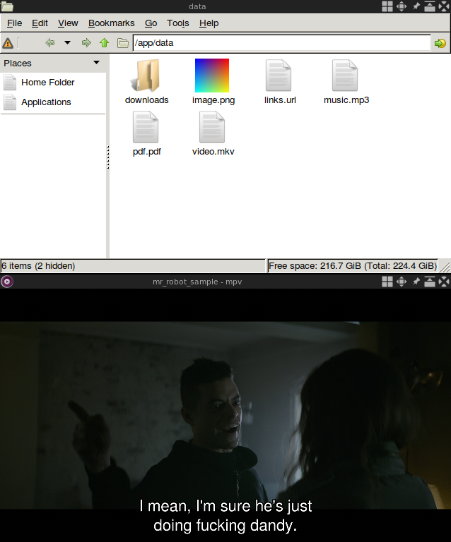

# Motivation

The purpose of this tool is to open files from unknown sources without putting in danger the integrity of your system. Files are rendered through X11 mirroring from the Docker container to the host machine. Opened files are never opened in your environment and only have access to the mounted volumes / devices. The container disconnected from the internet. I chose Docker containers because they are fast, light, easy to build and have a great community that I trust about security.

The tool supports image, video, sound, pdf and text formats.



# Setup

Make sure you have `xhost` and `docker` installed.

This command will open the current directory.

```
$ xhost +local:docker && \
  docker run  --volume $PWD:/app/data:ro \
              --volume /tmp/.X11-unix:/tmp/.X11-unix \
              --network none \
              --ipc host \
              --env DISPLAY=unix${DISPLAY} \
              --device /dev/snd \
              --device /dev/dri \
              lapwat/secure-open
```

To open another directory, replace `$PWD` with the **absolute** path you want to open into `secure-open`.

Remove `ro` option if you want to modify files mounted into the container.

# What is working ?

File type | Renderer | Associated extensions
--- | --- | ---
Image | feh | tif, tiff, bmp, png, jpg, jpeg, gif, ico
Video | mpv | mkv, mp4, webm, avi
Sound | mpg123 | mp3
PDF | xpdf | pdf
Text | leafpad | txt

Unknown extensions will be opened as text files.

Do not hesitate to ask for support for more file types or extensions.
